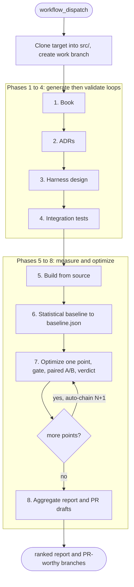
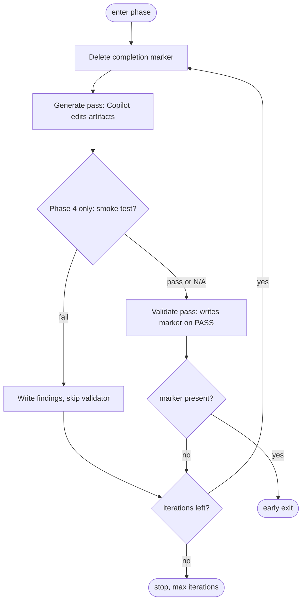

# CodeWeave

[](#quickstart)
[](executive-summary.md)
[](#how-it-works)
[](CONTRIBUTING.md)
[](../../issues)

**An autonomous pipeline that hunts energy and CO₂ hotspots in a codebase and ships the efficiency fixes it can prove real.** It works against a codebase of any language or stack, reading the target's toolchain from a manifest rather than assuming one. Every candidate change is measured for energy and carbon, cleared by a correctness gate, and accepted only when a statistical test says the improvement is genuine. The result is greener code that you do not have to take an agent's word for.

[](LICENSE)


> _CodeWeave exists to make software cost less energy. It drives the GitHub Copilot CLI across an eight-phase pipeline: it clones a target repository, documents it from the ground up, builds an energy- and latency-aware measurement harness, profiles the target for the paths that burn the most, and then runs autonomous optimization cycles. It measures energy and carbon (via CodeCarbon) on every change, and it accepts or rejects each change by experiment rather than by the judgement of the agent that wrote it._

<!-- VISUAL PLACEHOLDER:
     Recommended hero asset: a terminal recording, or the Phase 8 report table, showing one
     optimization cycle running from correctness gate to paired A/B measurement to a verdict,
     with the per-iteration energy and carbon figures alongside.
     [ADD DEMO GIF] [ADD LINK TO A REAL proof/ RUN] -->

### What it does

CodeWeave begins by finding where the energy actually goes. It profiles the target to rank the hotspots that dominate its energy and carbon cost, and it measures energy and carbon on every candidate change through CodeCarbon, normalized per iteration so the figure reflects the code rather than the wall clock. Energy and CO₂ are the objective that the entire pipeline is pointed at.

It then fixes those hotspots without breaking the program. Each proposed change must pass a six-stage correctness gate, covering a build and import check, an integration smoke test, a targeted unit test, a run of the target's own broad test suite, an output diff, and a blocking differential fuzz against a golden output captured on the base build. No measurement run is spent on a change until it has been shown to be correct.

Finally, it ships only the improvements it can prove. A change is accepted when the improvement is statistically real, which requires Welch's t-test to reject the null hypothesis at `p < 0.05` and the effect size to clear a measured noise floor. A Holm-Bonferroni correction is then applied across the whole campaign so that running many experiments does not manufacture a false winner. Every log, session transcript, gate diagnostic, and measurement record is written to `proof/`, so nothing is self-certified and every decision can be audited after the fact.

> **The honest mechanism.** Energy and carbon are the goal, and they are measured and reported on every change. CodeCarbon's resolution, however, is too coarse to arbitrate a single optimization on its own. The accept-or-reject verdict therefore runs on per-iteration latency, which is the tightly resolvable proxy for the same hot path, with energy and carbon reported next to each verdict. Put simply, energy is the target and latency is the lever precise enough to act on.

### In action

You point CodeWeave at a repository and dispatch a single workflow:

```bash
# .github/codeweave.config: the whole run is configured here; nothing is hardcoded
EXTERNAL_REPO_NAME=your-project
EXTERNAL_REPO_URL=https://github.com/your-org/your-repo
EXTERNAL_REPO_BRANCH=main
PHASE7_MAX_OPTIMIZATIONS=5     # how many hotspots to attempt

# one dispatch carries the run through all eight phases (Phase 7 and 8 auto-chain)
gh workflow run codeweave.yml -f dry_run=true    # smoke-test the structure first
gh workflow run codeweave.yml                     # then the real run
```

Each optimization cycle ends in one of five recorded terminal states. Only the first is worth turning into a pull request:

| State | Measured? | Meaning |
|-------|-----------|---------|
| **KEEP** | yes | A genuine improvement on the point's primary signal, so Phase 8 drafts a pull request |
| **INVESTIGATE** | yes | Measured but ambiguous, so the report recommends a manual re-measurement rather than a pull request |
| **REVERT** | yes | A regression, or no detectable effect, so the change is not submitted (the conservative default) |
| **FAILED** | no | The change was incorrect and failed the gate, so its branch is never pushed and it is never counted as a regression |
| **INCOMPLETE** | no | Built and gated, but the statistics could not be trusted, so it is excluded and flagged for a re-run |

**Start here:** [Quickstart](#quickstart), the [full per-phase docs](docs/index.md), the [executive summary](executive-summary.md), and [how it works](#how-it-works).

---

## Why CodeWeave exists

Software has an energy bill, and most of it hides in a small number of hot paths. Shrinking that bill by hand is slow work: you have to find the paths that matter, propose a change, confirm the change is still correct, and then prove that it actually saved energy rather than merely appearing to. The last step is the hardest, because energy and timing measurements are noisy and a plausible-looking win is often just thermal drift or a warm cache. CodeWeave was built to carry that whole loop autonomously, from finding the hotspot to proving the fix, on any codebase you point it at.

Coding agents make the first part easy and the last part dangerous. Ask one to speed up a hot path and you get a confident diff and a confident claim, for example that it is roughly ten percent faster. Verifying that claim is the real work. Is the change correct on the edge cases? Is the improvement real, or is it noise? Would it survive a second measurement? Multiply that by dozens of candidates and the cost of verification dwarfs the cost of generation, which is why agent-proposed optimizations so rarely reach production. The bottleneck was never generating ideas; it was trusting them.

CodeWeave is built on a single conviction: the agent that writes a change must never be the thing that certifies it. Generators propose, and a deterministic, statistically disciplined pipeline disposes. The agent edits source and authors specifications, while the pipeline builds, fuzzes, measures, and rules on the result. The verdict tool `ab_compare.py` is the single source of truth for every number, and the signal that a phase is complete is always a file written by an independent check rather than a claim made by the generator.

The long-term aim is greener software produced without a human babysitting every experiment. Energy and carbon are measured directly and treated as the ultimate objective, while per-iteration latency serves as the lever precise enough to resolve at the scale of one change. What emerges is an autonomous loop that can walk into an unfamiliar codebase, understand it, improve it under measurement, and leave behind an audit trail a reviewer can actually check.

A second goal follows from the way that loop is built. To optimize a system safely, CodeWeave has to understand it first, and the understanding it produces does not evaporate once the run ends. The architecture book, the per-area Architecture Decision Records committed next to the code they describe, and the grounded measurement harness are durable artifacts that outlive the optimization campaign. Software that had drifted into being effectively unmaintainable, opaque to the people who own it and risky to touch, comes back documented, mapped, and safe to change again. In this sense CodeWeave fights technical debt as it works: the same context it builds to find energy wins is also the context a team needs to maintain the system for years afterward.

---

## What CodeWeave takes seriously

Three commitments shape the design more than any single feature, and each is deliberate rather than incidental.

**The statistical proof is embedded on purpose, not bolted on afterward.** A result cannot be reported unless it has survived the statistics, because the statistics are wired into the acceptance path itself. Every comparison runs Welch's t-test and must also clear a Minimum Detectable Effect, a noise floor computed from the baseline's own run-to-run variance, so that a difference which is significant but trivially small cannot pass. Because the workload is a fixed-time loop that pins the wall clock, every verdict uses per-iteration metrics rather than elapsed time. The base build is re-measured in the same cycle as each variant, back to back, so that slow machine drift cancels instead of masquerading as a result. And across a long campaign of many experiments, a Holm-Bonferroni correction demotes any winner that does not survive family-wise control. The point of all of this is that trust is designed in: the pipeline is built so a finding you did not statistically earn simply cannot reach the report.

**The quality of the context it builds is what makes a change worth measuring.** Before it edits a single line, CodeWeave reads the system into an architecture book and a set of Architecture Decision Records, capturing subsystems, ownership boundaries, runtime behavior, and the paths that are sensitive to performance. Every later claim, including the choice of what to optimize and how, is grounded in those documents rather than in a keyhole view of one file. A generate-then-validate loop drives this understanding forward: a generation pass writes, an independent validation pass checks the result against an explicit checklist and records precise gaps, and the next generation pass closes those gaps before extending coverage, so the understanding deepens monotonically instead of churning. Good optimizations begin with a genuine model of the system, and building that model well is treated as part of the engineering, not a preamble to it.

**The integration tests are reverse-engineered from the real system, not assumed.** The measurement harness and the correctness gate are derived from how the target actually behaves, on the actual toolchain the target uses, discovered and pinned rather than guessed. The differential fuzz compares a changed build against a golden output captured from the base build of the same source tree, so that "correct" means "indistinguishable from the real system's own behavior on inputs that matter." Finding the right tests, the ones that truly exercise the hot path and would catch a regression there, is treated as a first-class problem: the harness specification is authored, validated, and only then turned into runnable code behind a smoke-test gate, so the tests that guard every optimization are ones that reflect the system as it really runs.

---

## Who it is for and what you would use it for

CodeWeave is aimed at the people responsible for large, compute-heavy systems where reducing the energy and time a program spends is a real and recurring job. It is designed to be independent of language and stack, reading the target's build and test toolchain from a manifest, so the same pipeline can be pointed at different kinds of codebase.

The most direct use is to find and prove efficiency wins in a hot codebase. You run the full pipeline and receive a ranked set of pull-request-ready branches, each carrying a statistical verdict and a per-iteration energy and carbon figure, together with honest REVERT and INVESTIGATE records for the ideas that did not pan out.

A second use is to recover a codebase that has become hard to maintain. The first four phases on their own produce an architecture book with a PDF, per-area Architecture Decision Records committed alongside the code they describe, and a runnable measurement harness, all grounded in the actual source rather than in generic assumptions about it. For software that had drifted into being effectively unmaintainable, this is a direct way to pay down technical debt: the system comes back documented, mapped, and safe to change, whether or not you go on to run the optimization phases.

A third use is to vet an agent's optimization before you trust it. The correctness gate combined with drift-controlled A/B measurement is exactly the review you would otherwise perform by hand for every candidate, except that it runs automatically and records its reasoning.

A fourth use is to stand up repeatable energy and performance measurement as reusable infrastructure. The measurement phases give you a fixed-time hot-loop harness, a statistical baseline with a computed noise floor, and a hotspot profile, all of which are useful independently of the optimization stage.

---

## Quickstart

CodeWeave runs as GitHub Actions workflows rather than as a local command-line tool. The later phases build and measure a native target, so they require a machine that persists state between phases.

### Prerequisites

You will need a self-hosted GitHub Actions runner (labelled `self-hosted, Linux, X64`) that keeps the built `src/` tree, the editable build environment, and a warm build cache between phases.

You will need access to the GitHub Copilot CLI, which the workflow installs automatically through `npm i -g @github/copilot`.

You will need two fine-grained personal access tokens stored as repository secrets. `COPILOT_TOKEN` authenticates the Copilot CLI and needs only the Copilot user requests Read account permission, with no repository permissions. `PUSH_TOKEN` needs Contents Read and write on the target repository alone, because Phase 2 pushes Architecture Decision Records and Phase 7 pushes optimization branches.

You will need the target's own build and test toolchain available on the runner. CodeWeave does not assume a particular language or package manager; you pin the toolchain your target needs in [`constraints/project.md`](constraints/project.md) and the optional [`constraints/harness.md`](constraints/harness.md), and the pipeline reads it from the generated manifest rather than hardcoding it.

### Steps

Fork this repository. Configure the run in [`.github/codeweave.config`](.github/codeweave.config), which holds the target repository URL and branch, the per-phase iteration caps, and the per-phase model schedules; none of this is hardcoded in the workflow logic. Fill in the constraint template in [`constraints/project.md`](constraints/project.md) with your target's real constraints, such as toolchain versions, build environment variables, and scope limits, and note that `constraints/harness.md` and `constraints/harness-context.md` are optional target-specific templates for the harness-design phase. Add the two secrets. Then smoke-test the structure before spending model time:

```bash
gh workflow run codeweave.yml -f dry_run=true
```

The dry run skips the Copilot invocations and the prerequisite checks, so you can confirm that the eight phases are wired correctly and that the Phase 7 auto-chain fires. When that looks right, start the real run:

```bash
gh workflow run codeweave.yml
```

### What you should see

A single dispatch cascades through the whole system. The first six phases document and baseline the target, after which `codeweave.yml` automatically dispatches Phase 7. Phase 7 optimizes one hotspot, gates it, measures a paired A/B experiment, records a verdict with its energy and carbon figures, and then dispatches the next cycle itself. The final cycle chains into Phase 8, which writes a ranked report and drafts a pull request for each result worth submitting. You dispatched once, and the pipeline ran an entire measurement campaign and handed back reviewable branches.

You can resume from any phase with `-f start_from_phase=N` for N from 1 to 6. The gates, inputs, and outputs of every phase are documented in [`docs/index.md`](docs/index.md).

---

## Core capabilities

### Understand an unfamiliar codebase (Phases 1 to 4)

The documentation phases produce an architecture book with a PDF rendered through Pandoc and Typst, a set of per-area Architecture Decision Records committed into the target's own source tree, and a runnable measurement harness, all grounded in the real source. This matters because every later measurement decision traces back to a documented claim, so the harness reflects the actual system rather than the model's priors.

The mechanism that keeps this honest is a generate-then-validate loop. A generate pass edits the artifacts, and a separate validate pass checks them against an explicit checklist and is the only step permitted to write the phase's completion marker. The validator writes a list of required actions, the next generator clears that list before doing anything else, and durable state files record the high-water mark, so the artifacts deepen across iterations instead of churning. The main cost is model budget: each phase runs several passes, and the iteration caps are set per phase in the configuration.

### Measure on a trustworthy substrate (Phases 5 and 6)

Phase 5 builds the target from source with a warm build cache, and Phase 6 establishes a statistical baseline together with a hotspot profile. Building from source means that later A/B comparisons compare two builds of the same source tree, and the baseline computes a noise floor, expressed as a coefficient of variation and a Minimum Detectable Effect, that every later verdict is held to.

A deliberate design choice sits underneath all of this. The workload is a fixed-time hot loop, so wall-clock time carries no signal: a faster build simply completes more iterations in the same budget. Every verdict therefore uses per-iteration metrics, such as median iteration latency, iteration count, and joules per iteration, and never raw wall clock.

### Optimize behind a correctness-first gate (Phase 7)

Phase 7 handles one optimization per dispatch. It generates the change, rebuilds incrementally with a verification step so that a change which compiles nothing cannot slip through, runs the six-stage correctness gate, and only then measures a paired A/B experiment. The change must be provably correct, including a blocking differential fuzz against a golden captured on the base build, before any measurement run is spent on it. The base side is re-measured in every cycle, back to back with the variant, so that slow machine drift over a long run cancels out instead of polluting the comparison.

There are two measurement paths, chosen per optimization from the baseline. A point whose end-to-end effect falls below the noise floor by construction is judged on a per-operation microbenchmark using the target's native benchmark timer, while other points are judged on end-to-end latency. The verdict logic is aware of which path applies and tests for regressions first. Energy and carbon are recorded on every change, but they inform rather than gate the verdict, because their resolution is too coarse to arbitrate a single optimization; a latency win that appears to cost energy is kept and flagged rather than silently discarded.

### Report with campaign-wide rigor (Phase 8)

Phase 8 reads every per-cycle verdict, applies the family-wise correction, ranks the results, summarizes any environment drift, and drafts a pull request for each result worth submitting. Running many cycles at a per-cycle significance of 0.05 inflates the chance of at least one false winner, so the Holm-Bonferroni correction across all cycles demotes any KEEP that does not survive the campaign-wide test. Phase 8 drafts the pull requests; opening them remains a deliberate human step. An INVESTIGATE result is a classification rather than an action: the system surfaces the ambiguous candidate and records why it is ambiguous, but it never re-measures or investigates on its own.

---

## How it works

A single `workflow_dispatch` runs eight gated phases. The first six run inside `codeweave.yml`, while Phases 7 and 8 are dedicated auto-chaining workflows: Phase 7 handles one optimization per dispatch and triggers the next, and the last chains into Phase 8.



The generate-then-validate loop is the structural backbone of the first four phases.



Three operating rules make the loop dependable. The pipeline owns every commit: Copilot runs non-interactively and is denied git in every phase except the Phase 7 optimization agent, which works on its own branch and reviews its own diff. Completion markers are deleted before each generate pass, so a stale marker can never short-circuit the next cycle. And the target's toolchain lives in a manifest rather than in the pipeline code: Phase 4 emits `integration-test/harness-manifest.json`, describing the build environment layout, smoke checks, profiler enable-environment, hotspot-report path, and gate commands, so the deterministic pipeline reads the toolchain instead of assuming a particular language or test runner. That manifest is the seam that lets the same engine run against different codebases.

The full detail, including every gate, input, and output per phase, lives in [`docs/`](docs/index.md) and in the [executive summary](executive-summary.md).

---

## How it is different

CodeWeave is neither a coding assistant nor a benchmark runner. It is the pipeline between them that turns an agent's efficiency claims into something you can trust. The table below compares it fairly with the two obvious alternatives, and the point is one of discipline rather than a criticism of coding agents; CodeWeave uses one, the GitHub Copilot CLI, as its generator. What differs is what happens to a change after it is written.

| | Ask an agent directly | Hand-roll a benchmark and review | CodeWeave |
|---|---|---|---|
| Energy and carbon measured | No | Rarely | On every change, per iteration |
| Correctness check before measuring | You do it, per change | You do it | Automated six-stage gate, including a differential fuzz |
| Improvement versus noise | The agent's word | Manual statistics, if any | Welch's t-test and a measured noise floor |
| Machine drift over a long run | Ignored | Manual re-runs | Contemporaneous A/B, base re-measured each cycle |
| False positives across many changes | Unaddressed | Rarely corrected | Holm-Bonferroni across the campaign |
| Output | A diff and a claim | A number you produced | Ranked, gated branches with a full `proof/` trail |
| Self-certification | The agent says it is done | Not applicable | Only an independent validator writes "done" |

---

## Project status

CodeWeave is experimental. It is a working, end-to-end pipeline that has been built and iterated against a large real-world codebase, but it has not yet been exercised across a range of targets and it has not been published with reproducible headline results.

What works today is the full eight-phase run: the generate-then-validate documentation loops, the source build, the statistical baseline, the correctness-gated optimization cycles with paired A/B verdicts, and the aggregate report with pull-request drafts.

What is now tested is the verdict engine itself. The code that decides every KEEP, INVESTIGATE, and REVERT, `integration-test/_tools/ab_compare.py`, is covered by a unit and integration suite exercising the decision table, the noise-floor gate, the Holm-Bonferroni correction, and all three command-line modes. The continuous integration workflow at [`.github/workflows/ci.yml`](.github/workflows/ci.yml) runs that suite on every push and pull request and lints the pipeline's own workflow YAML and shell scripts.

What remains experimental is portability across a wide range of targets. The manifest seam is designed to make the engine language- and stack-agnostic, but only a limited set of toolchains has been driven end to end so far. `[VERIFY portability on additional targets]`

Some behavior is manual by design. Phase 8 drafts pull requests but does not open them, and INVESTIGATE results are surfaced rather than acted on.

Several limitations are worth stating plainly. The pipeline requires a self-hosted, persistent runner, because the later phases reuse the build and the build environment in place and there is no ephemeral-runner path. It requires GitHub Copilot CLI access and two fine-grained tokens. Energy and carbon are measured and reported but do not gate individual verdicts, because their per-change resolution is too coarse. The model and CI cost scales with the iteration caps and the number of optimizations. And there are no published benchmark results yet. `[ADD BENCHMARK: headline energy and latency results from a real run]`

> **Maturity note.** Treat CodeWeave as a research-grade automation harness. Review every drafted pull request and read the `proof/` trail before shipping anything it produces.

---

## Documentation, community, and trust

The per-phase reference lives in [`docs/index.md`](docs/index.md), and the design rationale is in [`executive-summary.md`](executive-summary.md). Worked examples of the prompt files live under [`work/`](work), the language-neutral constraint templates you fill in for your target live under [`constraints/`](constraints), and a sample run's artifacts appear in `proof/`, which is created automatically. `[ADD LINK TO A PUBLISHED EXAMPLE RUN]`

The near-term direction is set out in [`ROADMAP.md`](ROADMAP.md), whose current focus is publishing a real run and verifying portability across additional targets through the manifest seam. Contributions are welcome; please read [`CONTRIBUTING.md`](CONTRIBUTING.md) first, and include the relevant `proof/` artifacts when you report pipeline behavior. For support, open a [GitHub issue](../../issues). `[ADD DISCUSSIONS LINK IF ENABLED]` Because the pipeline handles two access tokens and pushes branches to a target repository, please scope the tokens minimally as described under [Prerequisites](#quickstart) and report any vulnerability through [`SECURITY.md`](SECURITY.md).

## License

Copyright © 2026 Hightech ICT B.V.

Licensed under the GNU General Public License v3.0 or later. See [`LICENSE`](LICENSE).
