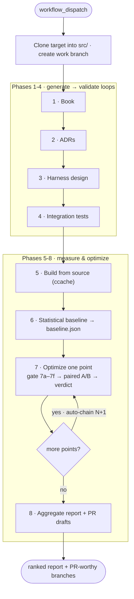
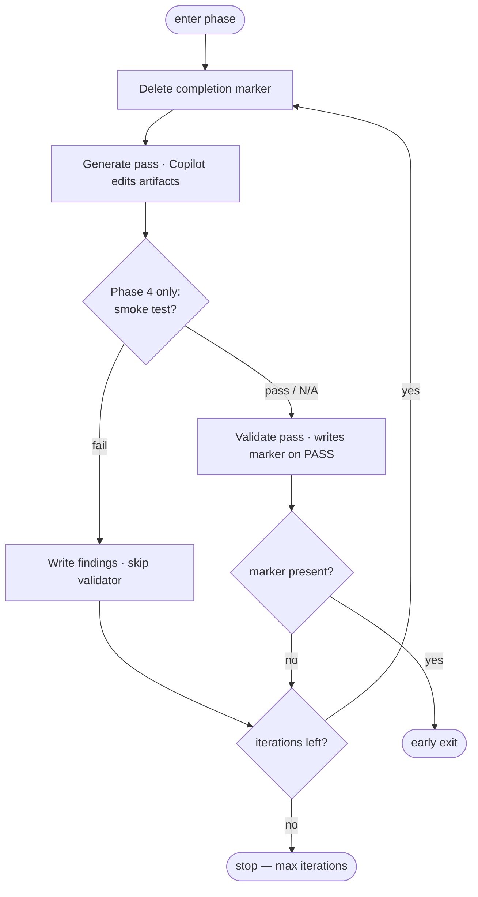

# CodeWeave

**An autonomous code-optimization pipeline that ships only the changes it can prove faster** — every candidate clears a correctness gate and wins a statistical A/B verdict before it becomes a PR. No change lands on an agent's unverified claim.

[](LICENSE)


> _CodeWeave drives the GitHub Copilot CLI across an 8-phase pipeline: it clones a target repo, documents it from the ground up, builds a measurement harness, establishes a statistical baseline, then runs autonomous optimization cycles — each accepted or rejected by an A/B experiment, not by the agent that wrote it._

<!-- VISUAL PLACEHOLDER:
     Recommended hero asset — a terminal recording (or the Phase 8 report table) showing an
     optimization cycle: correctness gate passing → paired A/B measurement → KEEP/REVERT verdict.
     [ADD DEMO GIF] · [ADD LINK TO A REAL proof/ RUN] -->

**Three things that make the verdicts trustworthy:**

- **Correctness before performance.** Every change passes a six-stage gate — import + op check, integration smoke, a targeted unit test, OpInfo, an output diff, and a *blocking differential fuzz* against a golden captured on the base build — **before a single timing run is spent on it.**
- **A real speedup, not noise.** A change is only KEEP when Welch's t-test rejects (`p < 0.05`) **and** the effect clears a measured noise floor (Minimum Detectable Effect). Phase 8 then applies a Holm–Bonferroni correction across every cycle and demotes any KEEP that doesn't survive the campaign-wide test.
- **Auditable end to end.** Every generate/validate log, session transcript, gate diagnostic, and measurement record is written to `proof/`, with git history as the diff trail. Nothing is self-certified.

### In action

Point CodeWeave at a repository and dispatch one workflow:

```bash
# .github/codeweave.config — the whole run is configured here, nothing is hardcoded
EXTERNAL_REPO_NAME=pytorch
EXTERNAL_REPO_URL=https://github.com/your-org/pytorch
EXTERNAL_REPO_BRANCH=main
PHASE7_MAX_OPTIMIZATIONS=5     # how many hotspots to attempt

# one dispatch carries the run through all eight phases (Phase 7/8 auto-chain)
gh workflow run codeweave.yml -f dry_run=true    # smoke-test the structure first
gh workflow run codeweave.yml                     # then the real run
```

Each optimization cycle ends in one of five recorded terminal states — only the first is PR-worthy:

| State | Measured? | Meaning |
|-------|-----------|---------|
| **KEEP** | yes | Significant improvement on the point's primary signal → Phase 8 drafts a PR |
| **INVESTIGATE** | yes | Measured but ambiguous → report recommends manual re-measurement, not a PR |
| **REVERT** | yes | A regression, or no detectable effect → not submitted (the conservative default) |
| **FAILED** | no | The change was incorrect (failed the gate) → branch never pushed, never counted as a regression |
| **INCOMPLETE** | no | Built and gated, but the stats couldn't be trusted → excluded, flagged for re-run |

**→ Start here:** [Quickstart](#quickstart) · [Full per-phase docs](docs/index.md) · [Executive summary](executive-summary.md) · [How it works](#how-it-works)

---

## Why CodeWeave exists

LLM coding agents are good at *proposing* performance changes and bad at *proving* them. Ask one to speed up a hot path and you get a confident diff and a confident claim — "~10% faster." Verifying that claim is the actual work: is the change even correct on the edge cases? Is the speedup real, or is it thermal drift and cache warmth? Would it survive being measured a second time? Multiply that by dozens of candidates and the verification cost swamps the generation cost.

So agent-proposed optimizations mostly don't ship. The bottleneck was never generating ideas — it was **trusting them.**

CodeWeave is built on one conviction: **the agent that writes a change must never be the thing that certifies it.** Generators propose; a deterministic, statistically rigorous pipeline disposes. The agent edits source and authors specs; the pipeline builds, fuzzes, measures, and rules. `ab_compare.py` is the single source of truth for every number. "Done" is always a file written by an independent check, never a claim.

The long-term goal is **greener software**. Energy and carbon are measured directly (via CodeCarbon) and treated as the ultimate objective; per-iteration latency is the lever we can resolve precisely enough to act on. The result is an autonomous loop that can walk into an unfamiliar codebase, understand it, and improve it under measurement — leaving behind an audit trail a human reviewer can actually check.

**Design philosophy, in five lines:**

- Generators propose; independent validators dispose.
- The pipeline owns truth and every commit.
- Correctness before performance — always.
- Measure the right thing, and only trust what you can resolve.
- Energy is the goal; latency is the lever.

---

## Who it's for and what you'd use it for

CodeWeave targets people responsible for large, performance-sensitive systems where "make it faster" is a real, recurring job:

- **"Find and prove wins in a hot library."** Run the full pipeline against a compute-heavy codebase (the reference target is PyTorch on CPU) and get back a ranked set of PR-ready branches, each with a statistical verdict — plus honest REVERT/INVESTIGATE records for the ideas that didn't pan out.
- **"Understand a codebase I inherited."** Phases 1–4 alone produce an architecture book (+ PDF), per-area Architecture Decision Records committed alongside the code, and a runnable measurement harness — grounded in the actual source, not generic assumptions.
- **"Vet an agent's optimization before I trust it."** The correctness gate + drift-controlled A/B measurement is the review you'd otherwise do by hand for every candidate, run automatically and recorded.
- **"Stand up repeatable performance measurement."** Phases 3–6 give you a fixed-time hot-loop harness, a statistical baseline with a computed noise floor, and a hotspot profile — reusable infrastructure independent of the optimization stage.

---

## Quickstart

CodeWeave runs as **GitHub Actions workflows**, not a local CLI. Phases 5–8 build and measure a native target, so they require a persistent machine.

### Prerequisites

- A **self-hosted GitHub Actions runner** (`[self-hosted, Linux, X64]`) that persists the built `src/` tree, the editable `integration-test/.venv`, and a warm ccache between phases. `[VERIFY SUPPORTED PLATFORMS — reference target is Linux/x64 + PyTorch CPU]`
- **GitHub Copilot CLI** access (installed automatically by the workflow via `npm i -g @github/copilot`).
- Two fine-grained PATs stored as repository secrets:
  - `COPILOT_TOKEN` — authenticates the Copilot CLI. Needs **Copilot user requests: Read** (account permission; no repo permissions).
  - `PUSH_TOKEN` — **Contents: Read and write** on the *target* repo only (Phase 2 pushes ADRs; Phase 7 pushes optimization branches).
- Toolchain for the target build. For the default PyTorch/CPU target that means **Python 3.12** specifically (see [`constraints/project.md`](constraints/project.md) for why — newer interpreters lack prebuilt wheels for the harness stack).

### Steps

1. **Fork this repository.**
2. **Configure the run** in [`.github/codeweave.config`](.github/codeweave.config) — target repo URL/branch, per-phase iteration caps, and per-phase model schedules. Nothing is hardcoded in the workflow logic.
3. **Replace the constraints.** [`constraints/project.md`](constraints/project.md) ships with a sample constraint — swap in your target's real constraints (toolchain versions, build env vars, scope limits). `constraints/harness.md` and `constraints/harness-context.md` are optional target-specific inputs for Phase 3.
4. **Add the two secrets** (`COPILOT_TOKEN`, `PUSH_TOKEN`).
5. **Smoke-test the structure first:**
   ```bash
   gh workflow run codeweave.yml -f dry_run=true
   ```
   `dry_run` skips Copilot invocations and prerequisite checks, so you can confirm the eight-phase wiring and the Phase 7 auto-chain before spending model time.
6. **Run it for real:**
   ```bash
   gh workflow run codeweave.yml
   ```

### The "aha" moment

Watch a single dispatch cascade: Phases 1–6 document and baseline the target, then `codeweave.yml` automatically dispatches Phase 7, which optimizes one hotspot, gates it, measures a paired A/B, records a verdict — and dispatches the *next* cycle itself. The last cycle chains into Phase 8, which writes a ranked report and drafts a PR per PR-worthy win. You dispatched once; the pipeline ran an entire measurement campaign and handed you reviewable branches.

Resume from any phase with `-f start_from_phase=N` (1–6). Full per-phase gates, inputs, and outputs: **[`docs/index.md`](docs/index.md)**.

---

## Core capabilities

### Understand an unfamiliar codebase (Phases 1–4)

**What it enables:** an architecture book (+ PDF via Pandoc → Typst), per-area ADRs committed into the target's source tree, and a runnable measurement harness — all grounded in the real source.

**Why it matters:** every later measurement decision traces back to a documented claim, so the harness reflects the actual system instead of the model's priors.

**How it stays honest:** each phase is a **generate → validate loop**. A generate pass edits artifacts; a *separate* validate pass checks them against an explicit checklist and is the **only** thing allowed to write the phase's completion marker. The validator writes a *Required Actions* list, the next generator burns that list down first, and durable state files record the high-water mark — so the manuscript expands and deepens across iterations instead of churning.

**Limitation:** requires enough model budget for multiple passes per phase; iteration caps are set per phase in `codeweave.config`.

### Measure with a trustworthy substrate (Phases 5–6)

**What it enables:** the target built *from source* (ccache-backed), plus a statistical baseline (`baseline.json`) and a hotspot profile.

**Why it matters:** A/B comparisons compare two builds of the *same* source tree, and the baseline computes a **noise floor** — a coefficient of variation and a Minimum Detectable Effect — that every later verdict is held to.

**Key design decision:** the workload is a **fixed-time hot loop**, so wall-clock time carries no signal (a faster build just completes more iterations). **Every verdict uses per-iteration metrics** (`median_iter_ms`, iterations, joules/iter) — never wall clock.

### Optimize under a correctness-first gate (Phase 7)

**What it enables:** one optimization per dispatch — generate the change, incrementally rebuild (with rebuild verification so a zero-compile edit can't slip through), run the **7a–7f correctness gate**, and only *then* measure a paired A/B.

**Why it matters:** the change must be provably *correct* — including a blocking differential fuzz against a base-build golden — before any timing run is spent. The A-side base is re-measured **every cycle**, back-to-back with the variant, to cancel machine drift over a long run.

**Two measurement paths:** ops whose end-to-end effect falls below the noise floor by construction are judged on a per-op microbenchmark (`torch.utils.benchmark`); others on end-to-end latency. The verdict logic is path-aware and directional (regressions tested first).

**Limitation:** energy is measured and reported but **does not gate** — CodeCarbon's resolution is too coarse to judge a single optimization, so a latency win that regresses energy still KEEPs and is merely flagged.

### Report with campaign-wide rigor (Phase 8)

**What it enables:** a ranked report plus a drafted PR per PR-worthy optimization.

**Why it matters:** running many cycles at `α = 0.05` inflates the odds of at least one false KEEP, so Phase 8 applies a **Holm–Bonferroni correction** across all cycles and demotes KEEPs that don't survive.

**Limitation:** Phase 8 *drafts* PRs; opening them is a deliberate human step. `INVESTIGATE` is a classification, not an action — the system surfaces ambiguous candidates and the reason (`decision_signal`), but never re-measures or investigates on its own.

---

## How it works

One `workflow_dispatch` runs eight gated phases. Phases 1–6 run inside `codeweave.yml`; Phases 7 and 8 are dedicated **auto-chaining** workflows — Phase 7 handles one optimization per dispatch and triggers the next, and the last chains into Phase 8.



The generate → validate loop is the structural backbone of Phases 1–4:



**Operating rules that make it dependable:**

- **The pipeline owns every commit.** Copilot runs non-interactively (`--no-ask-user`) and is denied git in every phase except the Phase 7 optimization agent (which works on its own branch and reviews its diff).
- **Markers are deleted before each generate pass**, so a stale "done" file can never short-circuit the next cycle.
- **Toolchain lives in a manifest, not the code.** Phase 4 emits `integration-test/harness-manifest.json` (venv layout, smoke checks, profiler enable-env, hotspot-report path, gate commands) so the deterministic pipeline reads the target's toolchain instead of hardcoding Python/pytest/venv — the seam intended to carry the engine beyond the PyTorch reference target.

Full detail — every gate, input, and output per phase — is in **[`docs/`](docs/index.md)** and the **[executive summary](executive-summary.md)**.

---

## How it's different

CodeWeave isn't a coding assistant and isn't a benchmark runner — it's the pipeline between them that makes an agent's performance claims trustworthy.

| | Ask an agent directly | Hand-roll a benchmark + review | **CodeWeave** |
|---|---|---|---|
| Correctness check before measuring | You do it, per change | You do it | Automated 6-stage gate incl. differential fuzz |
| Speedup vs. noise | Agent's word | Manual stats, if any | Welch's t-test **and** measured MDE floor |
| Machine drift over a long run | Ignored | Manual re-runs | Contemporaneous A/B, base re-measured each cycle |
| False positives across many changes | Unaddressed | Rarely corrected | Holm–Bonferroni across the campaign |
| Output | A diff + a claim | A number you produced | Ranked, gated PR branches + full `proof/` trail |
| Self-certification | The agent says "done" | — | Only an independent validator writes "done" |

This is a positioning of *discipline*, not a knock on coding agents — CodeWeave uses one (GitHub Copilot CLI) as its generator. The difference is what happens to a change after it's written.

---

## Project status

CodeWeave is **experimental**. It is a working, end-to-end pipeline that has been built and iterated against a real target (PyTorch, CPU), but it has not been hardened for arbitrary repositories or published with reproducible headline results.

- **Working today:** the full eight-phase run against the reference target — generate→validate documentation loops, source build, statistical baseline, correctness-gated optimization cycles with paired A/B verdicts, and the aggregate report with PR drafts.
- **Experimental:** portability beyond the PyTorch/CPU reference target. The manifest seam is designed for it, but other toolchains are unverified. `[VERIFY portability on a second target]`
- **Planned / manual by design:** opening PRs (Phase 8 drafts them); acting on `INVESTIGATE` results (surfaced, never auto-investigated).
- **Known limitations:**
  - Requires a **self-hosted, persistent runner** — Phases 6–8 reuse the build and venv in place; there is no ephemeral-runner path.
  - Requires GitHub Copilot CLI access and two fine-grained PATs.
  - Energy/carbon is **measured and reported but not gating** (resolution too coarse per change).
  - Model and CI time cost scales with iteration caps and optimization count.
  - No published benchmark results yet. `[ADD BENCHMARK — headline results from a real run]`

> **Maturity warning:** treat CodeWeave as a research-grade automation harness. Review every drafted PR and read the `proof/` trail before shipping anything it produces.

---

## Documentation, community & trust

- **Documentation:** per-phase reference in [`docs/index.md`](docs/index.md); the design rationale in [`executive-summary.md`](executive-summary.md).
- **Examples:** prompt and constraint files under [`work/`](work) and [`constraints/`](constraints); a sample run's artifacts appear in `proof/` (auto-created). `[ADD LINK TO A PUBLISHED EXAMPLE RUN]`
- **Roadmap:** [`ROADMAP.md`](ROADMAP.md) — near-term focus is publishing a real run and verifying portability to a second target via the manifest seam.
- **Contributing:** [`CONTRIBUTING.md`](CONTRIBUTING.md) — issues and PRs welcome; please include the relevant `proof/` artifacts when reporting pipeline behavior.
- **Support:** open a [GitHub issue](../../issues). `[ADD DISCUSSIONS LINK IF ENABLED]`
- **Security:** the pipeline handles two PATs and pushes branches to a target repo; scope tokens minimally as described in [Prerequisites](#quickstart). Report vulnerabilities via [`SECURITY.md`](SECURITY.md).

## License

Copyright © 2026 Hightech ICT B.V.

Licensed under the **GNU General Public License v3.0 or later**. See [`LICENSE`](LICENSE).
