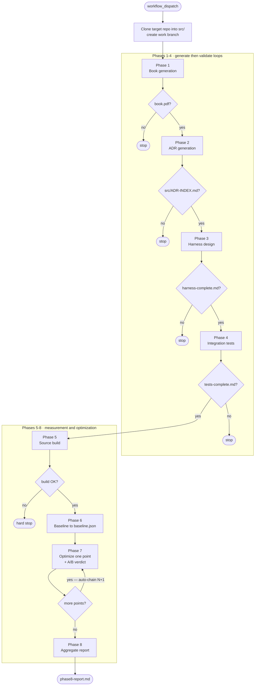
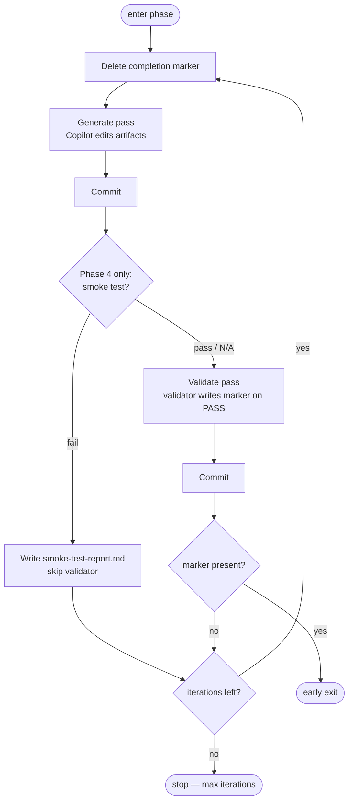

# CodeWeave — Process Documentation

CodeWeave is an automation system that runs the GitHub Copilot CLI across an
8-phase pipeline to analyse an external codebase, document it, build a
performance-measurement harness, establish a baseline, and then drive iterative
optimizations validated by A/B measurement.

This directory documents each phase: what gates it, what it consumes (environment
variables, prompt files, optional constraint files, and artifacts from earlier
phases), what it does, and what it produces.

## The eight phases

| # | Phase | Gate to enter | Completion artifact |
|---|-------|---------------|---------------------|
| 1 | [Book generation](phase-1-book-generation.md) | — (always runs) | `book/manuscript-complete.md` |
| 2 | [ADR generation](phase-2-adr-generation.md) | `book.pdf` exists | `src/adrs-complete.md` |
| 3 | [Harness design](phase-3-harness-design.md) | `src/ADR-INDEX.md` exists | `integration-test/harness-complete.md` |
| 4 | [Integration test generation](phase-4-test-generation.md) | `integration-test/harness-complete.md` | `integration-test/tests-complete.md` |
| 5 | [Source build](phase-5-source-build.md) | `integration-test/tests-complete.md` | `integration-test/reports/build-source.md` (gate) |
| 6 | [Baseline execution](phase-6-baseline-execution.md) | Phase 5 build succeeded | `integration-test/reports/baseline-complete.md` |
| 7 | [Optimization cycles](phase-7-optimization-cycles.md) | `src/` + `.venv` + v2 `baseline.json` | `proof/7-opt-N-complete.md` (per cycle) |
| 8 | [Aggregate report](phase-8-aggregate-report.md) | `proof/7-opt-*-complete.md` exist | `integration-test/reports/phase8-report.md` |

Phases 1–4 follow a **generate → validate loop** with file-based early exit (the
validator alone writes the completion marker; the generator never self-certifies).
Phases 5–8 are the **measurement-and-optimization** extension: Phase 5 builds,
Phase 6 measures the baseline, Phase 7 optimizes and A/B-tests, Phase 8 reports.

### Pipeline at a glance

Each phase is gated on the previous phase's completion artifact; Phase 7 auto-chains
one optimization per run until the points are exhausted, then triggers Phase 8.



### The generate → validate loop (Phases 1–4)

The same shape drives Phases 1–4. The pipeline deletes the marker before each generate
pass so a stale marker cannot short-circuit the next validate; only the validator writes
the marker (on PASS). Phase 4 adds a smoke-test gate — on failure the validator is
skipped and the error report feeds the next generate iteration.



## How it runs

`codeweave.yml` orchestrates Phases 1–6 by calling a per-phase reusable workflow
(`.github/workflows/phase-*.yml`) and sharing bootstrap via the
`.github/actions/codeweave-setup` composite action. Phase 7 (`phase-7-optimize.yml`)
and Phase 8 (`phase-8-report.yml`) run as two dedicated, **auto-chaining** workflows:
Phase 7 runs one optimization per dispatch and triggers the next (or Phase 8) via
`gh workflow run`. When Phase 6 produces a baseline, `codeweave.yml`'s
`trigger-phase-7` job dispatches the first Phase 7 cycle automatically, so a single
dispatch of `codeweave.yml` runs all eight phases end-to-end.

> **Runner assumption (Phases 5–8).** Phases 5/6 build an editable `integration-test/.venv`
> and a compiled `src/` tree that are **not** committed to git. Phases 6, 7, and 8
> reuse them in place on the **same self-hosted runner** (`clean: false` checkout,
> warm ccache at `~/.ccache-codeweave`). Phase 7/8 fail fast if `src/`, the `.venv`,
> or a v2 `baseline.json` are missing rather than silently rebuilding. If more than
> one runner carries the `[self-hosted, Linux, X64]` label, pin Phase 7/8 to the
> runner that ran Phase 5/6.

## Global inputs (shared by all phases)

These are not repeated in the per-phase pages.

### Repository / identity (`.github/.env`)

| Variable | Default | Meaning |
|----------|---------|---------|
| `EXTERNAL_REPO_NAME` | `pytorch` | Display name of the target repo |
| `EXTERNAL_REPO_URL` | `https://github.com/HighTech-Innovators/pytorch.git` | Clone URL of the target repo |
| `EXTERNAL_REPO_BRANCH` | `main` | Base branch cloned by Phase 1 |
| `EXTERNAL_REPO_WORK_BRANCH` | `copilot-work` | Work branch (Phase 2 pushes ADRs here; Phases 3–6 clone it; Phase 7 branches from it) |
| `GIT_USER_NAME` | `github-actions[bot]` | Commit author name |
| `GIT_USER_EMAIL` | `41898282+github-actions[bot]@users.noreply.github.com` | Commit author email |

### Scenario configuration (PyTorch/GenAI-specific, not framework config)

| Variable | Default | Meaning |
|----------|---------|---------|
| `GENAI_MODEL` | `distilgpt2` | Model the benchmark scenario exercises |
| `GENAI_MAX_SECONDS` | `30` | Fixed-time hot-loop budget per measurement run |

> Because the hot loop is **fixed-time**, `wall_clock_ms` is pinned by construction.
> All baseline and A/B verdicts therefore use **per-iteration** metrics
> (`median_iter_ms`, `iterations`, joules/iter) — never wall clock.

### Secrets (GitHub Actions)

| Secret | Used by | Purpose |
|--------|---------|---------|
| `COPILOT_OAUTH_TOKEN` | all Copilot phases | Authenticates the Copilot CLI (`GH_TOKEN`) |
| `PUSH_TOKEN` | Phase 2, Phase 7 | Fine-grained PAT (`Contents: write`) on the target repo — Phase 2 pushes ADRs to the work branch; Phase 7 pushes each gate-passing optimization branch |

### Prompt and constraint files

- **Prompt files** live in `work/` — one or two per phase (`work/N-generate-*.md`,
  `work/N-validate-*.md`, etc.). They are generic; all target-specific facts live in
  the constraint files or generated artifacts.
- **`constraints/project.md`** — repository-specific hard constraints, passed to
  every generative phase (1–4).
- **`constraints/harness.md`** *(optional)* — target execution constraints
  (hardware, scope, time budgets, isolation). Consumed by Phase 3. May also pin the
  target's toolchain (test runner, venv layout, smoke-check commands, profiler
  enable-env, hotspot-report path, incremental-build recipe, op-suite/import-op
  gate commands); Phase 3 carries those into `SOURCE-UNDER-INVESTIGATION.md §08`
  and Phase 4 serializes them to `integration-test/harness-manifest.json`, which the
  deterministic pipeline reads instead of hardcoding Python/pytest/venv.
- **`constraints/harness-context.md`** *(optional)* — domain context for the Phase 3
  scenario and observability design; also read by Phase 4.

### Copilot tool allowances

| Phase(s) | Allowed tools | Note |
|----------|---------------|------|
| 1–4 (generate/validate) | all tools **except** `shell(git:*)` | `--allow-all-tools --deny-tool='shell(git:*)'` — the pipeline performs all commits, so the agents never run git |
| 5 (build authoring) | `read`, `write`, `edit`, `create`, `shell` (git denied) | Authors `build-source.sh`; the pipeline executes it (the agent does not run the build) |
| 6 (repair only) | `read`, `write`, `edit`, `shell` (git denied) | Baseline collection is deterministic pipeline logic, not a prompt — the repair agent is the only Copilot invocation |
| 7 (hotspot selection) | `read`, `write`, `edit`, `create`, `shell` (git denied) | Authoring task — writes `optimization-plan.md`; the pipeline commits |
| 7 (optimization) | `read`, `write`, `edit`, `create`, `shell` (**git allowed**) | Works on an optimization branch in `src/`; reviews its own change with `git -C src diff` |
| 8 (report) | `read`, `write`, `edit`, `create`, `shell` (git denied) | Authoring task; verdicts already computed by `ab_compare.py` |

All Copilot invocations use `--no-ask-user` (non-interactive). Every phase except the Phase 7 optimization agent denies `shell(git:*)` — the pipeline owns all commits.

## Configuration flow

```
.github/.env  ──(bash: source)──>  environment variables  ──>  workflow steps
```

Every runtime setting is a `KEY=value` pair in `.github/.env`. The composite action
exports them into the environment; nothing is hardcoded in the workflow logic.
