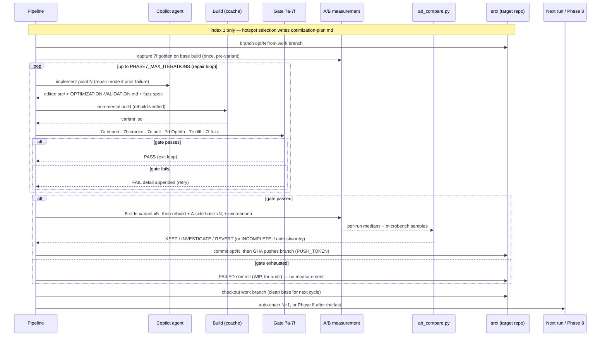
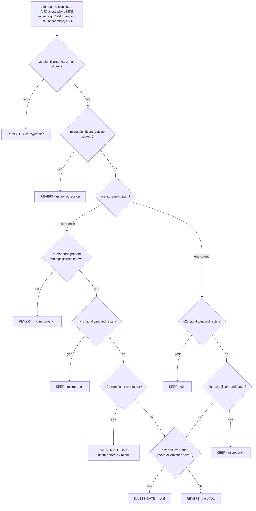

# Phase 7 — Optimization cycles

Selects hotspots, then runs one optimization per dispatch: generate a change, build
it incrementally, pass a six-part correctness gate, and decide KEEP/INVESTIGATE/REVERT
from paired A/B measurement. Cycles **auto-chain** — each run triggers the next, and
the last triggers Phase 8.

- **Workflow:** `.github/workflows/phase-7-optimize.yml` — a standalone, auto-chaining
  workflow (`gh workflow run`), **one optimization per dispatch**. The first cycle is
  dispatched automatically by `codeweave.yml`'s `trigger-phase-7` job once Phase 6
  produces a baseline; to start it by hand instead, run
  `gh workflow run phase-7-optimize.yml -f optimization_index=1`.
- **Gate to enter:** the runner has `src/`, the built `integration-test/.venv`, and a
  v2 `baseline.json` from Phase 5/6 (`clean: false`, warm ccache). Missing prerequisites
  fail fast — they are never silently rebuilt.

## Inputs

### Workflow dispatch inputs

| Input | Default | Meaning |
|-------|---------|---------|
| `optimization_index` | `1` | Which optimization (1-based) this run handles |
| `total_optimizations` | `0` | Total points; `0` ⇒ read `PHASE7_MAX_OPTIMIZATIONS` |
| `dry_run` | `false` | Exercise structure + auto-chain without copilot/build/measurement |

### Environment variables

| Variable | Default | Meaning |
|----------|---------|---------|
| `PHASE7_MAX_OPTIMIZATIONS` | `5` | Number of optimization points (cycles) |
| `PHASE7_MAX_ITERATIONS` | `3` | Max generate→build→gate attempts per optimization |
| `PHASE7_MODEL_SCHEDULE` | `claude-opus-4.6:1,claude-sonnet-4.6` | Model per iteration |
| `PHASE7_SELECTION_MODEL` | `claude-opus-4.6` | Model for hotspot selection (index 1) |
| `PHASE7_FUZZ_REQUIRED` | `1` | Gate 7f differential fuzz is blocking (set `0` only for an un-fuzzable op) |
| `PHASE7_BASELINE_RUNS` | `5` | Runs per measurement block (B-side and A-side) |
| `PHASE7_MICROBENCH_MIN_SECONDS` | `10` | Min runtime for the per-op microbenchmark |

Build env (`CCACHE_DIR=~/.ccache-codeweave`, etc.) and the [global inputs](index.md#global-inputs-shared-by-all-phases) apply. The branch push (see Outputs) uses the `PUSH_TOKEN` secret.

### Prompt and example files

- `work/7-select-hotspots.md` — hotspot selection → `optimization-plan.md` (index 1 only).
- `work/7-generate-optimization.md` — implements one change and authors the 7f fuzz spec.
- `work/fuzz-examples/opt{1,2}_fuzz.py` — worked fuzz-spec templates referenced by the prompt.

### Consumed artifacts

- `integration-test/reports/profiler-summary.md` + `baseline.json` — the ranked hotspot report (the §08 hotspot-report contract: location + self time + call count, ranked by self time) and the drift reference. The report is a required Phase 6 output, so Phase 7 hotspot selection can rely on it existing.
- `src/` on `EXTERNAL_REPO_WORK_BRANCH` — each cycle branches from it (`opt/N-<name>`).

## Process

**Step 1 (index 1 only):** hotspot selection → `integration-test/optimization-plan.md`.

**Each cycle** (`opt/N-<name>` branched from the work branch):

1. **Repair loop** (up to `PHASE7_MAX_ITERATIONS`): Copilot generates the change per
   `work/7-generate-optimization.md` and writes `OPTIMIZATION-VALIDATION.md` (structured
   fields: unit test file/pattern, OpInfo pattern, measurement path).
2. **7f golden capture** — on the base build, once, before the first incremental build.
3. **Incremental build** (ccache, `$VENV_PY`) with rebuild verification (C++ changed but
   0 compiles ⇒ edit never reached the build).
4. **Correctness gate 7a–7f:** 7a import+op (`smoke.import_op_cmd`) · 7b integration
   smoke · 7c targeted unit test (validated path, no `eval`) · 7d op-suite gate
   (`op_suite.file`, default `test_ops.py`; timeout ⇒ non-fatal SKIP) · 7e advisory
   output diff · **7f differential fuzz** (variant vs base golden via `diff_fuzz.py`,
   blocking when `PHASE7_FUZZ_REQUIRED=1`). The import-op command, op-suite file, and
   incremental-build env/command all come from `harness-manifest.json` (the built-in
   defaults are torch's); nothing in this phase is hardcoded to PyTorch.
5. **Measure** (only if the gate passed): B-side (variant) and A-side (base, rebuilt)
   blocks of `PHASE7_BASELINE_RUNS` each, plus per-op microbench.
6. **Verdict:** `ab_compare.py --mode compare` writes a directional,
   **measurement-path-aware** verdict (KEEP / INVESTIGATE / REVERT) on per-iteration
   metrics — never wall clock.
7. **Auto-chain:** trigger optimization `N+1`, or Phase 8 after the last. A FAILED
   optimization still chains.

### Cycle choreography

The actors and their hand-offs across one cycle — the repair loop, the gate, the paired
B-side/A-side measurement, the branch push, and the auto-chain:

## The science of the A/B comparison

Phase 7 has to decide whether one source change is a *real* improvement or just
measurement noise. The method and the statistics below are all implemented in
`_tools/ab_compare.py --mode compare` (the single source of truth) — this section
explains the reasoning behind them.

### Contemporaneous A/B blocks (drift control)

Each cycle measures **two builds back-to-back on the same runner**: a B-side block
(the variant) and an A-side block (the base, reverted and rebuilt fresh),
`PHASE7_BASELINE_RUNS` runs each. The A-side is re-measured *every cycle* rather than
reused from Phase 6, because machine conditions drift over the hours an auto-chained
run takes (thermal state, competing load, cache warmth). Measuring base and variant
within the same cycle cancels that slow drift: both sides see the same environment, so
their difference reflects the code change, not the clock. **The Phase 6 `baseline.json`
is not the comparison A-side** — it serves three other roles, below.

### What the Phase 6 baseline is (and isn't) used for

If Phase 7 re-measures a fresh base every cycle, why keep the Phase 6 baseline at all?
Because the fresh A-side and the baseline answer *different* questions. The fresh A-side
is the verdict's **comparator** ("is this variant faster than its own base, right
now?") — and the noise floor that gates the verdict is recomputed from *that* A-side's
CV, not from the baseline (`mde_pct = 2 × CV_A × 100` for the current cycle). The Phase 6
`baseline.json` is instead a fixed, pre-measured **anchor** with three jobs the fresh
A-side cannot do:

1. **It decides *how* each optimization is measured.** Hotspot selection
   (`work/7-select-hotspots.md`) reads the baseline `mde_pct` once, up front, and assigns
   every candidate op a `measurement_path`: `expected_e2e_delta_pct ≥ mde_pct` → `end-to-end`,
   otherwise → `microbench`. An op whose expected end-to-end effect is below the baseline
   noise floor cannot be judged end-to-end at n=5 (decision D9), so it is routed to the
   per-op microbench. This planning happens *before any cycle runs* — there is no fresh
   A-side yet, so it needs a stable reference.
2. **It gates entry / confirms harness health.** Phase 7 and hotspot selection refuse to
   start unless a valid v2 `baseline.json` is present (the A7 prerequisite) — proof the
   build + harness can produce trustworthy stats before any optimization cycle is spent.
3. **It detects cross-cycle machine drift.** The within-cycle pairing protects each
   verdict, but is blind to the machine *itself* drifting over the hours of an
   auto-chained run. `drift_check` compares each cycle's fresh A-side against the baseline
   median (threshold = the baseline's MDE) and flags `environment_drift` for the Phase 8
   report, so a marginal verdict measured on a drifted machine can be discounted.

In short: the **fresh A-side** is the comparator (drift-controlled within the cycle); the
**Phase 6 baseline** is the planning floor, the entry gate, and the drift anchor for the
whole campaign. Remove it and Phase 7 loses the ability to assign measurement paths, to
know the harness is trustworthy, and to detect machine drift.

### Per-iteration metric, never wall clock

As in Phase 6, the workload is a fixed-time hot loop, so wall clock and raw energy are
pinned by construction and carry no signal. The comparison is on each side's per-run
**`median_iter_ms`** (the median drops the warm-up outlier). A faster build shows up as
*more iterations*; `ab_compare` checks that iterations move in the opposite direction to
latency as a sanity cross-check.

### The test: significance **and** the noise floor

The end-to-end verdict uses **Welch's t-test** (`equal_var=False`) on the
`PHASE7_BASELINE_RUNS` per-run medians of each side — unequal-variance because the two
builds need not have the same spread. But significance alone is not enough: with low
variance, Welch can reject on a difference far below what the harness can actually
resolve. So an e2e effect is **actionable only when both hold**:

- `p < 0.05` (Welch), **and**
- `|Δmedian_iter| ≥ mde_pct`, where `mde_pct ≈ 2 × CV_A × 100` is the minimum
  detectable effect computed from *this cycle's* A-side coefficient of variation.

That MDE floor (decision A5) is what keeps a statistically-significant-but-trivial
change from becoming a KEEP.

### Two measurement paths — and why

Each optimization point declares a `measurement_path` in `optimization-plan.md`:

- **`end-to-end`** — the e2e `median_iter_ms` test is the **primary** signal; a
  significant per-op microbench is bonus corroboration. Used when the op's expected
  effect is above the baseline MDE.
- **`microbench`** — the **per-op microbenchmark** (`op_microbench.py`,
  `torch.utils.benchmark`) is primary. Many hot ops contribute an end-to-end effect
  *below the n=5 noise floor by construction* (decision D9); the e2e number simply
  cannot resolve them, so the verdict rests on the op-level measurement instead. The
  microbench has its own significance rule — a Welch t-test on the raw timing samples
  at `α=0.05` **and** a ≥2 % median-delta practical floor.

  On the microbench path the microbench is **required**: if it is missing or its
  significance is unknown (no raw samples), the primary signal does not exist and the
  cycle **REVERTs** (`no-microbench`) rather than fall back to the sub-floor e2e number
  (A4). And an e2e "win" the microbench does *not* corroborate here is almost certainly
  within-cycle drift (the B block is measured before the A block), so it is demoted to
  **INVESTIGATE** (`e2e-unsupported-by-micro`), not kept.

### The directional decision table

`decide()` applies these rules, **first match wins** (the `decision_signal` records
which rule fired):

| # | Condition | Verdict (signal) |
|---|-----------|------------------|
| 1 | e2e significant (p<0.05 ∧ \|Δ\|≥MDE) and variant **slower** | REVERT (`e2e-regression`) |
| 2 | microbench significant and op **slower** | REVERT (`micro-regression`) |
| 3 | *microbench path:* microbench absent / unknown | REVERT (`no-microbench`) |
| 4 | *microbench path:* microbench significant and faster | KEEP (`microbench`) |
| 5 | *microbench path:* e2e significant + faster but microbench flat | INVESTIGATE (`e2e-unsupported-by-micro`) |
| 6 | *end-to-end path:* e2e significant and faster | KEEP (`e2e`) |
| 7 | *end-to-end path:* microbench significant and faster | KEEP (`microbench`) |
| 8 | any positive trend, not significant | INVESTIGATE (`trend`) |
| 9 | otherwise | REVERT (`no-effect`) |

Regressions are tested first and on *either* signal, because **REVERT is conservative**
— it only means "do not submit as a PR." A drift-induced false regression costs nothing,
whereas a missed regression would ship a bad change.

The same logic as a flow (first matching branch wins; the primary signal is set by
`measurement_path`):

### Drift check (flagged, not gating)

The fresh A-side is also compared against the Phase 6 `baseline.json`:
`environment_drift = |A − ref| > MDE`. Drift does **not** change the verdict — the
contemporaneous pairing already protects it — but it is recorded so Phase 8 can flag any
verdict whose margin is comparable to the drift.

### Energy is reported, not gated

Per-iteration energy (`delta_joules_per_iter_pct`) is computed and reported, but
CodeCarbon's resolution is too coarse to discriminate a single optimization, so it never
gates KEEP/REVERT (see Phase 6's energy caveat). A latency win that regresses energy
still KEEPs and is flagged in the Phase 8 report.

### Terminal verdicts and the family-wise correction

A cycle ends in one of these states, recorded in `proof/7-opt-N-complete.md`:

- **KEEP / INVESTIGATE / REVERT** — a measured A/B verdict (above); carries an
  `ab-comparison-optN.json`.
- **FAILED** — the correctness gate (7a–7f) did not pass; the change is wrong. No
  measurement is taken and no comparison JSON is written.
- **INCOMPLETE** — the change built and passed the gate, but the measurement itself
  could not be trusted (short record set, a no-op A-side rebuild, or a measurement
  error), so **no `ab_compare` was run** — a verdict is never emitted off bad data (A1/A3).
  This is an infrastructure outcome, not a defect in the change.

Per-cycle significance is at `α=0.05`; across many auto-chained cycles that inflates the
chance of at least one false KEEP (~1 − 0.95ᴺ). **Phase 8 therefore applies a
Holm-Bonferroni family-wise correction** (`ab_compare.py --mode family`) over all
*measured* cycles and demotes any KEEP that does not survive to INVESTIGATE (A5).
`FAILED` and `INCOMPLETE` cycles are excluded from the ranking entirely.

## Outputs

### Optimization branches (in the target repo, `src/`)

This is the actual deliverable: the code change. It lives in a **different git
repository** from everything else here — the cloned target repo under `src/`, which the
outer CodeWeave repo git-excludes (`.git/info/exclude`).

- `opt/N-<name>` — a branch forked from `EXTERNAL_REPO_WORK_BRANCH` inside `src/`, holding
  the candidate change. On success the cycle commits `opt/N: <name>`; a FAILED optimization
  leaves a `opt/N: FAILED … (WIP, for audit)` commit on the branch and then checks the work
  branch back out (so the A-side rebuild measures a clean base).
- **The cycle pushes each gate-passing branch to the target repo.** It pushes each
  gate-passing `opt/N-<name>` branch to `EXTERNAL_REPO_URL` (using `PUSH_TOKEN`) — the
  runner is ephemeral, so the push is the only way the change escapes it. This requires
  `EXTERNAL_REPO_URL` to be **writable**: either owned directly or **your fork of an
  upstream public repo** (the normal fork-and-PR setup). FAILED branches are not pushed.
- **Opening the PR is manual.** Phase 8 drafts a PR *describing* each optimization;
  turning a pushed branch into an actual pull request is a deliberate human step.

### Generated artifacts (`integration-test/`)

#### Reports (`integration-test/reports/`)

- `run-records-optN.json`, `run-records-base-optN.json` — paired B-side / A-side measurement records.
- `microbench-optN-{variant,baseline}.json` — per-op microbenchmark results.
- `ab-comparison-optN.json` / `.md` — the directional, measurement-path-aware **verdict** (consumed by Phase 8).
- `fuzz-golden-optN.pt`, `fuzz-diff-optN.json` — the 7f base golden and the variant-vs-golden diff.

#### Plan and gate files (`integration-test/`)

- `optimization-plan.md` — ranked hotspots with target op and measurement path (written at index 1, read by every cycle).
- `OPTIMIZATION-VALIDATION.md` — per-cycle structured gate spec / repair context.
- `fuzz/optN_fuzz.py` — the agent-authored differential-fuzz spec for gate 7f.

### Proof artifacts (`proof/`)

- `7-hotspot-selection.md` / `-session.md` — selection log/transcript (index 1).
- `7-opt-N-generation-ITER.md` / `-session-ITER.md` — per-iteration generation.
- `7-opt-N-ccache-ITER.txt`, `7-opt-N-gate-notes.md` — build/gate diagnostics.
- `7-opt-N-complete.md` — **per-cycle completion** (name, branch, gate OK, verdict).

## Downstream

Phase 8 reads every `proof/7-opt-*-complete.md` and `ab-comparison-opt*.json`.
